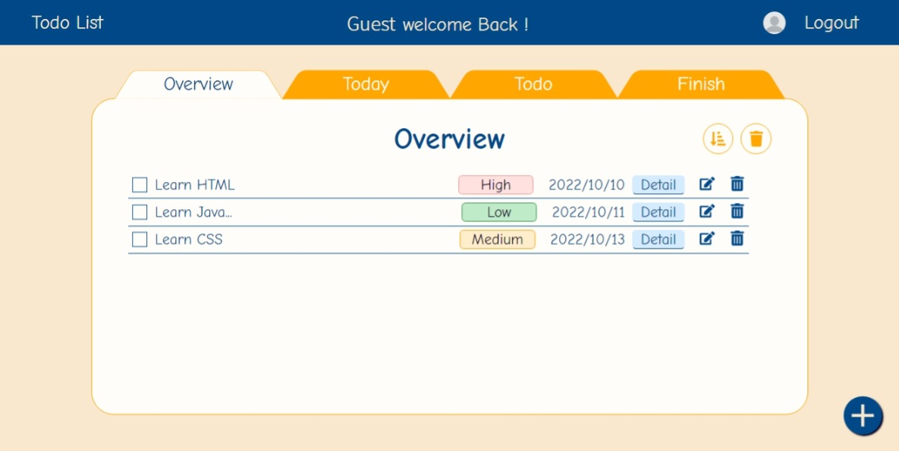
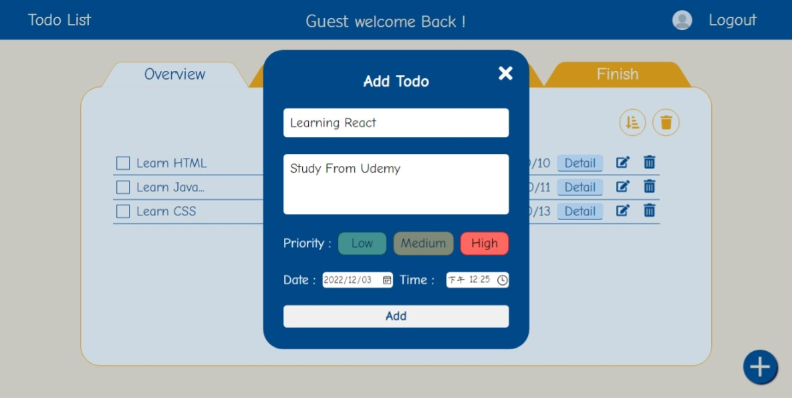
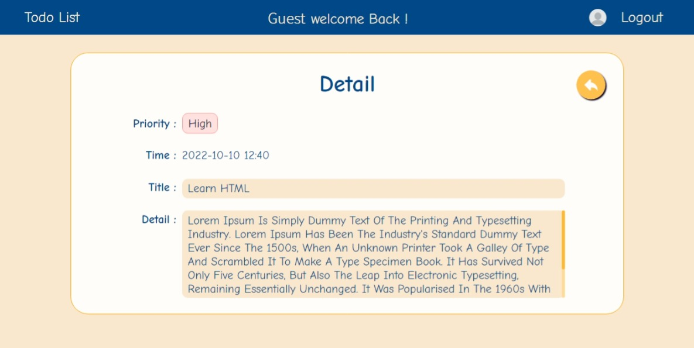
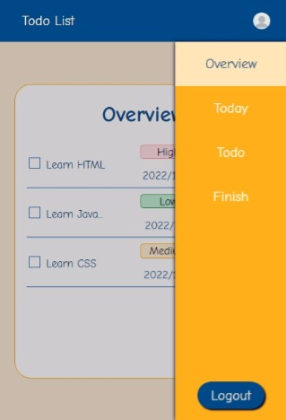

# Todo list

[💻 Live Demo](https://jim-todolist-react-firebase.netlify.app/)

[🎨 Design Figma](https://www.figma.com/file/H4fTXqarsDdUMaYGNyqe7O/Todolist?node-id=0%3A1&t=fawqtTuE5pRnIvmf-1)

## Table of contents

-   [Overview](#overview)
    -   [Feature](#Feature)
    -   [Built with](#built-with)
    -   [Screenshot](#screenshot)

## Overview

### Feature

Users should be able to:

-   Home
    -   Facebook login（Save your unique todo list）
    -   Google login（Save your unique todo list）
    -   Guest login ( Can't save todo list )
-   TodoList
    -   Add/ Remove/ Edit todo ( Title/ Detail/ Prority/ Date/ Time ) .
    -   Filter width different tags （Overview/ Today/ Todo/ Finish）.
    -   See the todo detial.
    -   Sort todo by adding time.

### Built with

-   RWD
-   CSS module
-   [React](https://reactjs.org/) - JS library.
-   [React Router](https://reactrouter.com/en/main) - For route link.
-   [SASS](https://sass-lang.com/guide) - CSS Preprocessor.
-   [Firebase](https://firebase.google.com/) - save data and authentication.

### Screenshot

-   Desktop

    
    
    
    

-   Mobile

 
